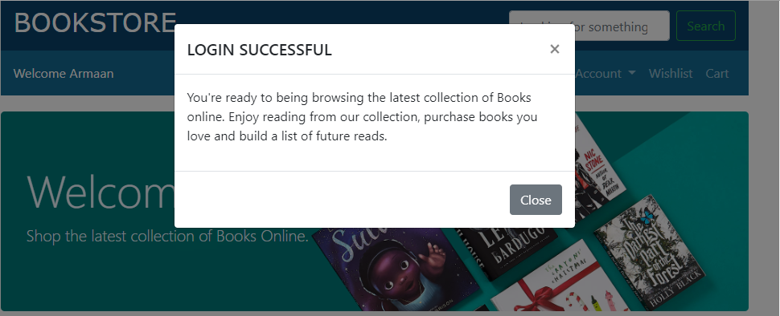
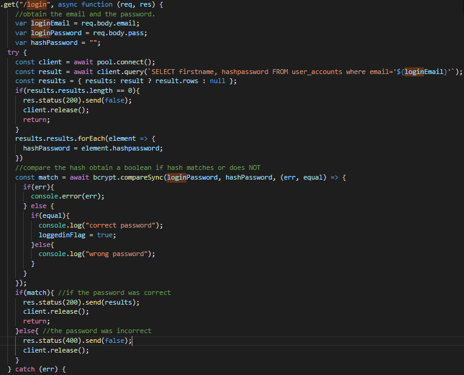

## 1.1 How to use the system:  
My application is an E-Commerce bookstore website hosted on a Heroku server which is connected to a Postgresql Database. The application uses a RESTful server and the Google Books API to obtain service and book information, enabling the website to achieve its functionality. Users are able to register/signup with either a local system account, or be authenticated through their google accounts using OAuth. To use the system users are able to view the link: https://afternoon-crag-26447.herokuapp.com/?#.
The functionality offered by the RESTful Interface is as follows:  

* Create account  
* Login  
* Search Books  
* View Newest Releases  
* View Suggestions  
* Add Books to Cart   
* Add Books to Watchlist  
* Logout

## 1.2 What error handling has been implemented into the system:
Validation and error handling has been implemented through every area of the system that in which ambiguity to the user can occur. Functions that result in multiple execution branches - such as logging; can either be a fail or success - are handled in such a way that the user is not unaware of what is occurring. Shown below is an example of login error handling - all cases are defined in the use cases (1.3).

Example of Success:    
Example of Failure - wrong password:    
Each of these errors are handled through the evaluation of the response obtained by the RESTFul service. This means that the processing of errors is done at the server side it , dependant on the outcome of the response received by the server different information is shown to the client browser. For example, following the same logging in example discussed above, we can see how the different outcomes are a result of server side evaluations: We are able to see that the outcomes of evaluating the hashed passwords, results in different information being sent to the RESTful resource thus resulting in different information being displayed to the user. Evaluating information at the server side increases the security of the application as the additional abstraction results in information being harder to obtain by potential attackers. These error handling principles outlined in this example of the login functionality is followed by each major function within the application. For more details - refer to git or 1.3 use cases.  

## 1.3 Use Cases:
The following use cases involve the most essential functions of the application. They are identified by a short goal statement and each include a use case body. 
##

### 1.3.1 Users can create an account:
**Brief Description:**  A user can create an account locally If their desired email is not currently in use, having their inputted information stored securely within the database. E.g - password is hashed and random salt is generated.

**Precondition:**   

* Email being used by user is NOT within the database.  
* Password is validated and both inputs match  
* Each field within the form is filled out.  

**Basic Path:**  

* User follows path to ‘Create Account’ link/buttons.
* User fills in form and clicks submit
* Application evaluates inputs at server side
	* If successful - use is prompted with success message, and prompted to login 
	* If unsuccessful - user is prompted with popup explaining likely cause of  error found.

**Post Condition:**  
The user information is inputted into the user_accounts database - securely

**Exception Path:**

* Some fields were left blank - user to made aware.  
* Passwords do not match.

### 1.3.2 Users can login
**Brief Description:**  A user can login with the email and password after account has been successfully created. Or a user can login using the google account information, through the OAuth service.

**Precondition:**   

* User has created a local account - if signing in locally  
* Users password and email have to match the password hash and email in database  
* User enters correct Google information and an auth token from google is received.

**Basic Path:**  

* User follows path from ‘Login’ link/buttons.  
* User fills in form and clicks submit  
* Application evaluates inputs at server side  
	* If successful - use is prompted with success message, and prompted with welcome message. User view of webpage changes - increased functionality of the application  
	* If unsuccessful - user is prompted with popup explaining likely cause of  error found.
  

**Post Condition:**

* The user has full functionality of the application. - Access to wishlist, cart, search features.

**Exception Path:**  

* email/password was incorrect.
  

### 1.3.3 Search Books
**Brief Description:** A user can enter desired search information into the search bar. This retrieves that query from google books api and displays it on new HTML page. Users obtain a more detailed rundown of the books and are able to add to watchlist/cart from here.

**Precondition:**  
 
* User has successfully logged in 

**Basic Path:**  

* User clicks search box and enters search criteria.   
* User is redirected to search page - showing detailed information they desired.  

**Post Condition:**

* The user has full functionality of the application. - Access to watchlist, cart, search.
* Users can browse books
* Users can return home

**Exception Path:**

* Clicking submit of the search box requires the contents of the search box NOT to be “”/null

### 1.3.4 Adding to wishlist
**Brief Description:** From either the home page or the search page, a user can add a selected book to their wishlist should they click the “add to wishlist” icon/button. 

**Precondition:**

* Selected book is added to the users wishlist  

**Basic Path:**  

* User clicks the ‘add to wishlist’ button/icon of the desired book from either the homepage/search page

**Post Condition:** 

* The specific user has the selected books ISBN number stored in a wishlist table within the database. This uses the specific users unique id to link the books in wishlist to a given user.

**Exception Path:**  

* The user has previously added this book to their wishlist - no duplicates in the database.

### 1.3.5 Adding to cart
**Brief Description:** From either the home page or the search page, a user can add a selected book to their wishlist should they click the “add to cart” icon/button. 

**Precondition:**

* Selected book is added to the users cart  

**Basic Path:**  

* User clicks the ‘add to cart’ button/icon of the desired book from either the homepage/search page

**Post Condition:** 

* The specific user has the selected books ISBN number stored in a wishlist table within the database. This uses the specific users unique id to link the books in cart to a given user.

**Exception Path:**  

* The user has previously added this book to their cart - no duplicates in the database.

  
  

